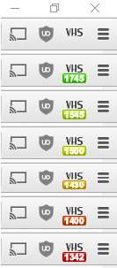
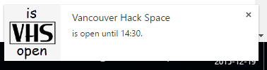

# isvhsopen Chrome Extension
Extension for Google Chrome to show the status of isvhsopen.com

This extension places an icon ([browser action](https://developer.chrome.com/extensions/browserAction)) in the toolbar of Google Chrome, showing whether VHS is open or closed, and the time that it is open until. It does this by polling http://www.isvhsopen.com/api/status/ once a minute (defined in [background.js](./isvhsopen/background.js)). By clicking the icon, you can prompt it to poll immediately and update the icon.

When the space is open, the closing time is shown using an icon [badge](https://developer.chrome.com/extensions/browserAction#badge). Since badges are limited to 4 characters, the time is shown in 24-hour HHMM format. The badge color is configured to fade from green (closing in >5h) to yellow (closing in 1h) to red (closing in 1 min).



When the isvhsopen status changes, a browser notification pops up to alert the user.




## Installation
This extension is not in the Chrome Web Store yet, I plan to submit it after a period of public beta testing. If you'd like to install it in the mean time:

Download this repository as a zip and extract it or clone the repository with git. then go to chrome://extensions/, check the Developer Mode checkbox in the top right, and drag the ```isvhsopen``` extension folder from your copy of the repository onto the window.
